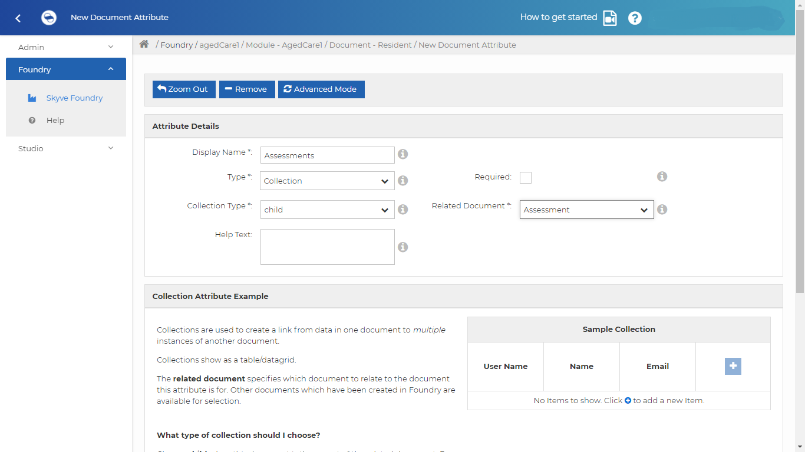
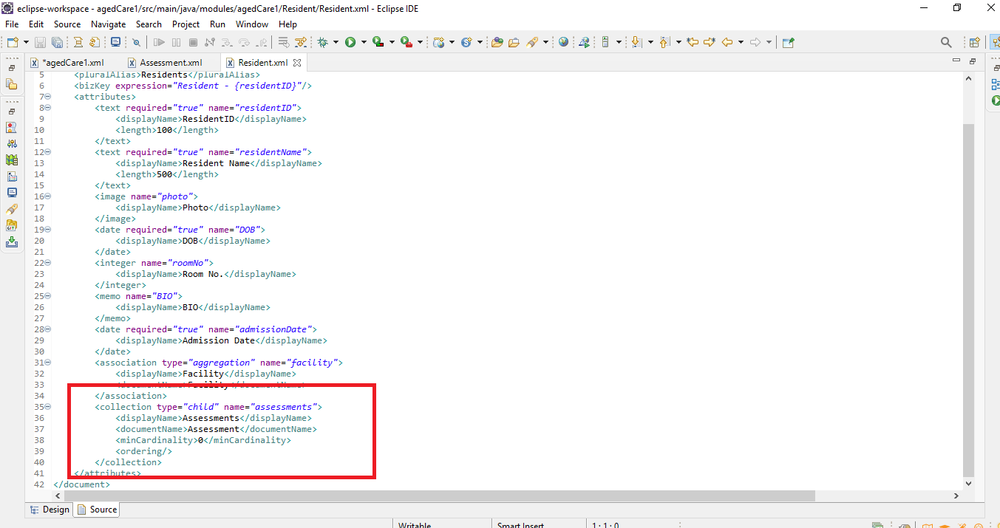

Skyve provides two main ways of accessing data, namely list and detail views. The `list` view allows you to search for the data you wish to change and is normally what you see when you choose a menu item. Once you select a record you will see the `detail` view - which allows you to enter, change or delete data.

Skyve will provide default generic list and edit views. Skyve supports rapid prototyping of the domain model and gives the developer an ability to begin interacting with the application at an early stage.

List views provide searching and reviewing of data. They show data in the context of other data in the system. Lists are usually based on queries that you can define. However, for simple applications, Skyve will automatically list all records for each type of `document`.

Each row of the list corresponds to an instance of the document (a record) but may include columns from associated documents within the document's object hierarchy.
For example, the list of Residents may include columns for the Facility and Staff because these documents are associated to the Resident records.

### Resident List

The Resident list shows the details of each resident, according to the attributes we defined when creating the Aged Care application.

So that we can control exactly what is shown in the list, we will define a query and specify what columns are shown and in which order. To do this, we add a query definition to the agedCare module (as shown below).

To make the application easier to use, it can be useful to hide some columns in the list. In this case we will hide the attributes `admissionDate` and `residentId` for the Resident records, and display the Resident photo as a thumbnail image.

A thumbnail is a scaled down version of the image. If you store high quality images of each resident (e.g. 5MB each), when you include these images in the list, the user would have to receive a lot of data to view the list. For example, if there were 50 rows of Resident data, this would mean that the user would have to receive 50x5MB of data. This would make the `list` view appear very slow to use. Instead, Skyve automatically generates scaled down versions of images (thumbnails) and these can be included in the `list` so that application performance is not compromised.

This means we can include a thumbnail column in our query to show the images of each Resident without significantly impacting the performance of our application.

Open agedCare.xml in the `modules.agedCare` package inside the `src/main/java` folder.

Immediately after the Menu declaration in agedCare.xml, declare Queries as shown below:

```xml
<queries>
    <query documentName="Resident" name="qResident">
    <description>All Resident</description>
    <columns>
   	<content display="thumbnail" binding="photo" pixelHeight="45" pixelWidth="45" />
    	<column binding="residentID" sortOrder="ascending" hidden="true" />
    	<column binding="residentName" sortOrder="ascending" />
    	<column binding="DOB" sortOrder="ascending" />
    	<column binding="roomNo" sortOrder="ascending" />
    	<column binding="BIO" sortOrder="ascending" />
    	<column binding="admissionDate" sortOrder="ascending" hidden="true" />
    	<column binding="facility.facilityName" sortOrder="ascending" />
    </columns>
    </query>
</queries>
```

Here the `content query column` provides a `content` column type for content items like image and file attachments.

You can specify a default query for each document in the module (in the agedCare.xml file ) and this will ensure that wherever a list is shown for this document in your application, you will always get the same query.

To do this, set defaultQueryName for the Resident document to be the name of our query (agedCare.xml in documents declaration) as shown below:

```xml
<documents>
        <document ref="Resident" defaultQueryName="qResident"/>
        <document ref="Facility"/>
        <document ref="Assessment"/>
        <document ref="Contact" moduleRef="admin"/>
        <document ref="DataGroup" moduleRef="admin"/>
        <document ref="User" moduleRef="admin"/>
</documents>
```

To apply the change, stop the `WildFly` server and run the `Generate Domain` command, then start the `WildFly` server again.


### Facility List

Next, let's see our Facility list. Currently, it shows a column for each of the attributes we have defined in the document.

Instead, we will create another module query to define precisely which columns are shown.

In the module (agedCare.xml file), we will define a Facility query which hides the attributes `Location` and `Facility manager` as shown below.

Open agedCare.xml

Immediately after the Menu declaration in agedCare.xml, declare Queries as below:

```xml
<query documentName="Facility" name="qFacility">
	<description>All Facilities</description>
	<columns>
		<column binding="facilityName" sortOrder="ascending" />
		<column binding="buildingNumber" sortOrder="ascending" />
		<column binding="streetName" sortOrder="ascending" />
		<column binding="suburb" sortOrder="ascending" />
		<column binding="state" sortOrder="ascending" />
		<column binding="facilityManager" sortOrder="ascending" hidden="true" />
		<column binding="location" sortOrder="ascending" hidden="true" />
	</columns>
</query>
```

Then provide the `defaultQueryName` attribute to your Facility document in `agedCare.xml` as below:

```xml
<documents>
	<document ref="Resident" defaultQueryName="qResident" />
	<document ref="Facility" defaultQueryName="qFacility" />
	<document ref="Assessment" />
	<document ref="Contact" moduleRef="admin" />
	<document ref="DataGroup" moduleRef="admin" />
	<document ref="User" moduleRef="admin" />
</documents>
```

To apply the change, stop the `WildFly` server, run the `Generate Domain` command, then start the `WildFly` server again.


### Assessments List

In the `Assessment` document, you can see the different assessments related to each resident.

Let's hide `painAssessement` `behaviourAssessment` and `assessmentReviewTime` from the document and add the resident's name and photo.

To add the resident name and photo in the `Assessment` document, we need to define the collection in the Resident document first.

So, go to [Foundry]() and open the Resident document in the App.

Add a new attribute called `Assessments` of the type collection and the related document is `Assessment` as shown below.



Then, go to the Collaborate Tab and commit and push the changes to GitHub.

Next, go to Eclipse and pull the change to your local environment by right clicking on the project and selecting Team>Pull.

To see changes, open `Resident.xml`. A new collection attribute is added in your attributes.



Let's try defining a query: Add a query to your module (the agedCare.xml file):

```xml
<query documentName="Assessment" name="qAssessment">
    <description>All Assessments</description>
    <columns>
    	<content display="thumbnail" binding="parent.photo" pixelHeight="60" pixelWidth="60" />
    	<column binding="parent.residentName" sortOrder="ascending" />
    	<column binding="hygieneAssessment" sortOrder="ascending" />
    	<column binding="painAssessment" sortOrder="ascending"   hidden="true"/>
    	<column binding="continenceAssessment" sortOrder="ascending" />
    	<column binding="sleepAssessment" sortOrder="ascending" />
    	<column binding="behaviourAssessment" sortOrder="ascending" hidden="true" />
    	<column binding="assessmentCreatedBy" sortOrder="ascending" />
    	<column binding="assessmentReviewTime" sortOrder="ascending" hidden="true" />
    </columns>
</query>
```

Then, set the `defaultQueryName` attribute to your Assessment document, as shown below.

```xml
<documents>
    <document ref="Resident" defaultQueryName="qResident"/>
    <document ref="Facility"  defaultQueryName="qFacility"/>
    <document ref="Assessment"  defaultQueryName="qAssessment"/>
    <document ref="Contact" moduleRef="admin"/>
    <document ref="DataGroup" moduleRef="admin"/>
    <document ref="User" moduleRef="admin"/>
</documents>
```

Again, to apply the change, stop the WildFly server, run the Generate Domain command, then start the WildFly server.


Continue to [3.9. Edit Views, Layout and Components]({{ site.url }}{{ site.baseurl }}ch3-edit-views/)