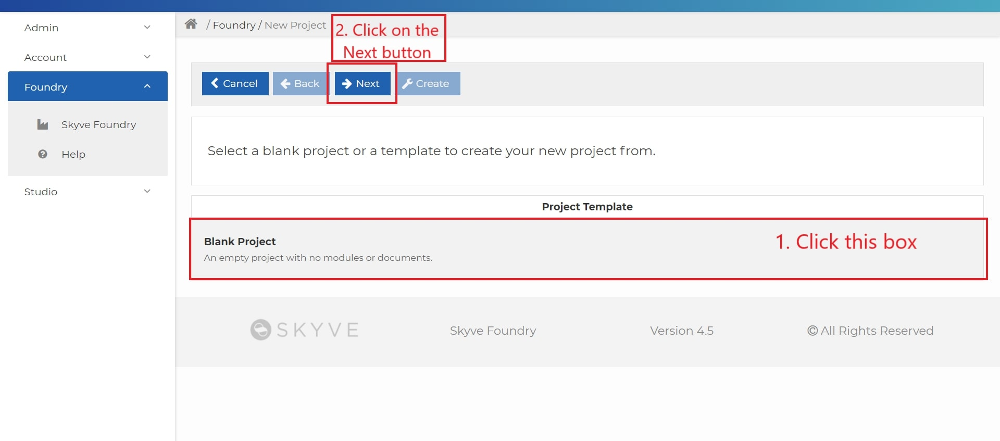
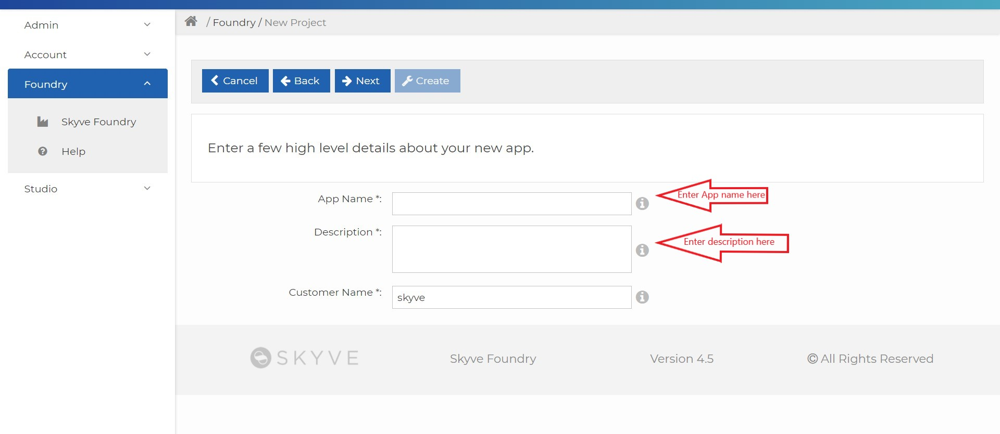
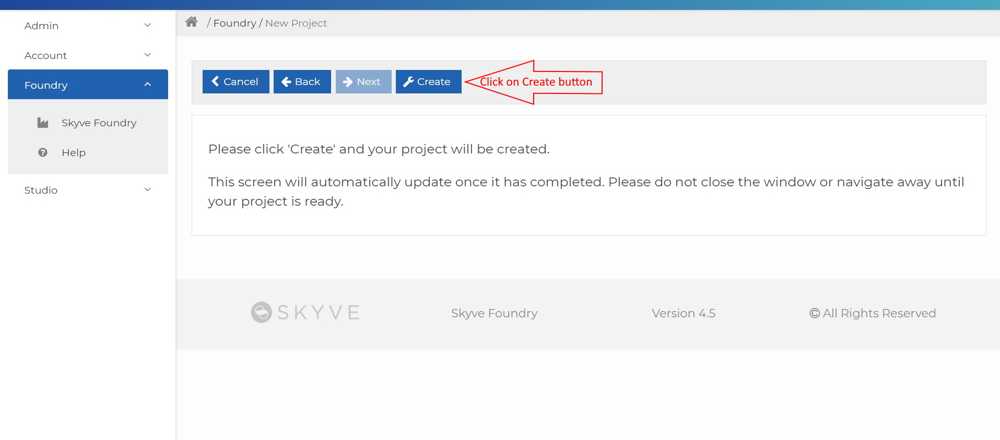

In this section, we will go through the development of the Aged Care application and will cover information about the Skyve platform and Skyve [Foundry](https://foundry.skyve.org/foundry/) in detail.

This section also covers how to create and add different documents: Residents, Assessments, and Facilities in the Aged Care application and how to deploy an application in [Foundry](https://foundry.skyve.org/foundry/).

## 2.1. Introduction to Foundry

A succinct statement of the purpose, key functions and general nature of Foundry includes (but is not necessarily limited to):

- One-stop point-and-click tool for building apps
- Define all the data to be managed by your app, how it’s organised and how it’s related
- Deploy apps to a webserver so anyone can use them on the web

To create a new [Skyve](https://skyve.org) Project, we need to register our account first with the following steps:

- Go to the [Skyve Foundry](https://Foundry.skyve.org/)
- Click on [Register](https://foundry.skyve.org/foundry/register.xhtml) and enter your account details

  

- Activate your email address and if you have already registered [Sign in](https://foundry.skyve.org/foundry/login) with your registered email address and password.

To create a new Skyve project through [Foundry](https://foundry.skyve.org/foundry/), go to the [How to get started video](https://youtu.be/G3OQu5PeUn8) on the top right-hand side of the Skyve [Foundry](https://foundry.skyve.org/foundry/) page and watch the video for more information.

## 2.2. Create your Aged Care app in Foundry

In Skyve [Foundry](https://foundry.skyve.org/foundry/), we can create and manage browser-based applications. Skyve [Foundry](https://foundry.skyve.org/foundry/) allows us to create numbers of applications, and each one will have a single record showing here on the welcome screen.

Now, I will take you step by step through the creation of the application:

- Click the Add button

  
  
- Click on the option box "Blank Project" template, then click the Next button.

- Enter the name and brief description of the app, and click the Next button.

  
  
- Click on the Create button to create your project.

  

- Start designing your data documents (Data Design)

## 2.3. Data-driven Design in Foundry

Data driven design refers to how organisations use data to make their content more appealing to users by analysing their behaviour. In Skyve Foundry, we used different data designs such as modules, documents, and attributes to design an application.

**Modules:** In Skyve, modules define self-contained areas of functionality and have their own menu group. By default, Foundry apps start with a single module called the Admin module. In the Design tab of your application, you can add or remove a module using the Add button.

**Documents:** In data design, documents are related to the real business entities (e.g. Residents, Facilities, Assessments). For more details about documents click on this link https://skyvers.github.io/skyve-dev-guide/concepts/

**Attributes:** Attributes contain information about each document (e.g. Resident's document attributes: name, id, photo, bio etc.). Attributes can have different data types and different views.

**Data types:** Data types specify which type of value an attribute name can hold. They include:

* Text or String: Used for a combination of any characters that appear on a keyboard, such as letters, numbers and symbols.
* Memo: Used to store a large amount of text. It is also called "Long Text".
* Date: Includes the time, year, name of the day of the week, and time zone.
* Image: Used when we want to upload an image into our document.
* Integer: Used to store the numeric values.
* Geometry: Used to map a three-dimensional object, such as a building.
* Date/Time: Used for values that contain both date and time parts.
* Association: Used where there is a relationship between two entity objects based on common attributes. An entity object only needs an association to access the data of another entity object.

## 2.4. Create your Resident document

The Resident document will contain the personal information about the residents and the information about the facility they were admitted to.

The Resident document contains the attributes as below:

| Attribute name | Data Type   | Length |
| -------------- | ----------- | ------ |
| ResidentID     | Text        | 100    |
| Resident Name  | Text        | 500    |
| Photo          | Image       |
| DOB            | Date        |
| Room Number    | Integer     |
| BIO            | Memo        |
| Admission Date | Date        |
| Facility       | Association |

The `Facility` attribute will be an association to a Facility (held in the Facility data table). The association represents a link to the entire Facility record (including name, address etc). In a database this is called a foreign key, but in Skyve it is called an association. In the Aged Care application we are building, we will expect to see a drop-down list for this attribute, so that the user can select the associated Facility record.

Now, we will create the Resident document and add attributes to the Resident document in following steps:

- Click on Data Design to add Documents

  

- Add all information as shown below and click on Zoom out

  

- You can see your document on the screen.

- Next, create documents for Facility and Assessment the same as you did for Resident. Click on the arrow to add attributes for each document.

  
  
  Note: Use the `building` icon for the Facility document and the `book` icon for the Assessment document icon.

- Click on the Add button to add attributes to the Resident document

  

- Add all the attributes for the Resident document as shown below:

  

## 2.5. Create your Facility document

The Facility document will contain information about the facility, including the facility name, manager, full address and location.

The attributes for Facility document are given below:

| Attribute Name   | Data Type   | Length |
| ---------------- | ----------- | ------ |
| Facility Name    | Text        | 500    |
| Building Number  | Integer     |        |
| Street Name      | Text        | 500    |
| Suburb           | Text        | 500    |
| State            | Text        | 500    |
| Facility Manager | Association |        |
| Location         | Geometry    |        |

The `Facility Manager` attribute will be an association to a system user (held in the User data table). The association represents a link to the entire User record (including name, access levels, contact details, etc.). In a database, this is called a foreign key, but in Skyve, it is called an association. In the Aged Care application we are building, we will expect to see a drop-down list for this attribute, so that the user can select the associated record for the system user who is the facility manager.

Adding attributes to this document will follow the same steps as we followed for Resident document. It should appear as below:

## 2.6. Create your Assessment document

The Assessment document will contain information about the care assessments related to each resident.

The attributes for the Assessments document are as below:

| Attribute name         | Data Type   | Length |
| ---------------------- | ----------- | ------ |
| Hygiene Assessment     | Memo        |
| Pain Assessment        | Memo        |
| Continence Assessment  | Memo        |
| Sleep Assessment       | Text        | 600    |
| Behaviour Assessment   | Memo        |
| Assessment Created By  | Association |
| Assessment Review Time | Date/Time   |

The `Assessment Created By` attribute will be an association to a system user (held in the User data table). The association represents a link to the entire User record (including name, access levels, contact details etc). In a database, this is called a foreign key, but in Skyve, it is called an association. In the Aged Care application we are building, we will expect to see a drop-down list for this attribute so that the user can select the associated record for the system user who is a Staff member.

In our attributes list, `Sleep Assessment` does not need an unlimited size because it is a brief description of what state of sleep the resident is in at the time of the assessment, e.g. Awake, Asleep, Active, Resting, etc.

Follow the same steps as used for the Resident and Facility documents. The Assessment document should look as below:

## 2.7. Deploy your Aged Care app

Our Aged Care application is almost ready, now the next step is to deploying our application to check how it looks like. (Note: If you are using a free trial version, you can only deploy your application for one hour. To use the free version for another hour, you need to re-deploy it).

The following steps should be used to deploy the Aged Care application that we created in [Foundry](https://foundry.skyve.org/foundry/):

1. Go to [Foundry](https://foundry.skyve.org/foundry/) and click on the Aged Care application

2. Click on the Deploy tab, add User password and confirm that password. Then click on Deploy. The process to deploy your application usually takes 2 minutes.

   

3. Next, click on the deployment link

   

4. Sign in with user "setup" and the password which you initialised during deployment

## 2.8. Using your Aged Care app

Your application is ready to go. It contains two modules: Admin and Aged Care. These two modules show as two menus in the application as shown below.
The Admin module is provided as part of the Skyve platform for all applications. It provides a range of powerful administration features, including:

- user and access management
- scheduled backups and restoring from backups
- ability to import and export data
- scheduled jobs and tasks
- comprehensive system user activity audit tracking, keeping records of every user interaction in the system.

In the Aged Care module, you will see a menu item for each of the three documents we created in the foundry. Let's see what it looks like...

Click to expand the Aged Care menu.

You will notice two red lines - one at the top of the screen and one at the bottom of the screen.
Generally, organisations will run several instances of their application, for example, Production, Quality Assurance, Test/UAT, Development, etc. For non-production instances, Skyve adds these labels so that the person using the system clearly understands if they are working on a Production instance.

In this case, we are using the Foundry `Free Trial` instance, so the two red indicators show. When you move to a production instance (either hosted on Foundry, or on your own infrastructure) these instance identifiers will not show.

Click on Facilities and then the Add button

Enter the detail of a facility in the fields and click on the "OK" or "Save" button.

**OK button:** This button performs a Save and Close action when clicked. This will save the changes and return you to the previous page.

**Save button:** This button will save any changes you have performed in the current page when you clicked on it.

So, press OK or Save as you go.

Next, click on Residents and then the Add button. Follow the same steps as for adding a facility.

Then, click on Assessments

Add data in Assessments by following the same steps as for a Facility and Resident.

### Desktop Mode

Skyve provides two separate user interface: Normal mode and power user mode. In normal mode, the interface is responsive and mobile and tablet friendly whereas the power user mode is great for desktop browsers.

To switch between the interfaces, click on the switch icon on the top-right of the application screen.

After switching:

### Making Changes and Re-Deploying

The [Foundry](https://foundry.skyve.org/foundry) free trial server will automatically undeploy your project after one hour - but you can re-deploy your application as many times as you need during your testing. Your data is saved while the project is offline.

<!-- ## 2.9. Foundry & App FAQs

- Can I make changes to my app after I’ve deployed it?
- I deployed my app – why did it stop working ?
- How do I re-deploy my app ?
- I’ve got what I came for. Can I build my own app now ? -->

Continue to [Low Code Extensions]({{ site.url }}{{ site.baseurl }}chapter3/)