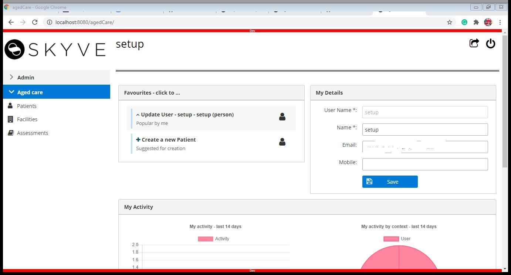

# Aged care Application Tutorial

### Contents

- [1. Is This Tutorial Right For Me ?](https://github.com/seema-source/Aged-care/blob/master/readme.md#1-is-this-tutorial-right-for-me-)
- [2. Aged care App Overview](https://github.com/seema-source/Aged-care#2-aged-care-app-overview)
  - [Functionality overview](https://github.com/seema-source/Aged-care/blob/master/readme.md#functionality-overview)
  - [Low code App using Skyve Foundry](https://github.com/seema-source/Aged-care/blob/master/readme.md#low-code-app-using-skyve-foundry)
  - [Low-code Extensions](https://github.com/seema-source/Aged-care/blob/master/readme.md#low-code-extensions)
- [3. No-code Development](https://github.com/seema-source/Aged-care/blob/master/readme.md#3-no-code-development)
  - [1. Getting Started](https://github.com/seema-source/Aged-care/blob/master/readme.md#1-getting-started)
  - [2. Create](https://github.com/seema-source/Aged-care/blob/master/readme.md#2-create)
  - [3. Collaboration](https://github.com/seema-source/Aged-care/blob/master/readme.md#3-collaboration)
- [4. Low-code Extensions](https://github.com/seema-source/Aged-care#4-low-code-extension)

  - [4.1 Configure local environment](https://github.com/seema-source/Aged-care#41-configure-your-local-environment)

    - [Download and Install Eclipse and JDK](https://github.com/seema-source/Aged-care#download-and-install-eclipse-and-jdk)

      - [Download and Install Eclipse](https://github.com/seema-source/Aged-care#download-and-install-eclipse)

      - [Download and Install JDK](https://github.com/seema-source/Aged-care#download-and-install-jdk)

  - [4.2 Install and Configue Wildfly Server](https://github.com/seema-source/Aged-care#42-install-and-configue-wildfly-server)

    - [Install Wildfly Server](https://github.com/seema-source/Aged-care#install-wildfly-server)

  - [4.3 Add Repository in Eclipse](https://github.com/seema-source/Aged-care#43-add-repository-in-eclipse)
  - [4.4 Import Project](https://github.com/seema-source/Aged-care#44-import-project)

  - [4.5 Set the server](https://github.com/seema-source/Aged-care#45-set-the-server)
  - [4.6 Deploy and Configure Skyve Project](https://github.com/seema-source/Aged-care#46-deploy-and-configure-skyve-project)
  - [4.7 List Views](https://github.com/seema-source/Aged-care#47-list-views)
    - [Patient List](https://github.com/seema-source/Aged-care#patient-list)
    - [Facility List](https://github.com/seema-source/Aged-care#facility-list)
    - [Assessments List](https://github.com/seema-source/Aged-care#assessments-list)
  - [4.8 Edit Views, Layout, and Components](https://github.com/seema-source/Aged-care#48-edit-views-layout-and-components)
    - [Patient Edit view](https://github.com/seema-source/Aged-care#patient-edit-view)
    - [Facility Edit view](https://github.com/seema-source/Aged-care#facility-edit-view)
    - [Assessment Edit view](https://github.com/seema-source/Aged-care#assessment-edit-view)
  - [4.9 Roles](https://github.com/seema-source/Aged-care#49-roles)

- [5. Java Extensions](https://github.com/seema-source/Aged-care#5-java-extension)

  - [Conditions](https://github.com/seema-source/Aged-care#conditions)
  - [Bizlets](https://github.com/seema-source/Aged-care#bizlets)
  - [Actions](https://github.com/seema-source/Aged-care#actions)

# 1. Is This Tutorial Right For Me ?

- Tutorial Purpose
- What We'll Cover
- What You'll Get Out Of It
- Skills You'll Need
- Skills You'll Develop

# 2. Aged care App Overview

This tutorial will talk about how to create an advanced application through the Enterprise Application Framework - [Skyve foundry](https://foundry.skyve.org/).

In this tutorial, we will build a simple application to manage aged care facilities, their patients, and care assessments. We will also configure collaboration so that both non-coders and Java developers can collaborate and work together on the project.

This project will cover the Skyve development process and its concepts as much as possible.

### 2.1. Aged Care Functionality overview

In Aged Care, Patients are regularly assessed to ensure that they are well and safe, and the care is being provided to them matches their needs. Therefore, Care providers record details of different Care Assessments for each Patient daily. These records are maintained both to prompt regular care activities and also for care management to be audited and checked.

In this tutorial, you will create a simple app to maintain details of Aged Care facilities, Patients, and Care Assessments.

### 2.2. No-code Development

In the first part of our tutorial, we will cover the no-code development - a no-code application can be created using only the point-and-click actions in Skyve foundry.

In this tutorial, we will build the Aged Care application step by step using Skyve Foundry covering the three main components of the application: Patient records, their daily Care Assessments, and the details of the Facility at which they reside.

If your goal is limited to developing no-code applications using Foundry, you may wish to leave the tutorial at this point. Otherwise, we encourage you to proceed to the Low-code Extensions.

### 2.3. Low-code Extension

The second part of the tutorial will focus on Low code extension. In Low code extension, we can do some changes in XML files created by Skyve to extend the application functionality beyond point-and-click actions in Skyve foundry.

In the next part of the tutorial, we will load our Aged care application created through Skyve foundry into an IDE- Integrated Development Environment (set of programming tools for writing an application). To extend its functionality using Skyve's Low code XML language.

In this part of the tutorial, we will edit and change the layout to the Patient, Assessment, and Facility documents.

If you believe that you already achieved what you want from this tutorial and you do not have java programming skills, you can leave the tutorial at this point. Otherwise, we encourage you to proceed to the Java Extensions.

### 2.4. Java Extension

In the third part of our tutorial, we will cover the Java extension-add custom built java code into the Skyve application to make your application more powerful.

In this part, we will extend the functionality of the Aged care application using java code. We will add a few conditions and actions using java in our application so that only particular users can access particular Assessments related to each Patient.

# 3. No-code Development

In this section, we will go through the development of the Aged care application and will cover information about the Skyve framework and Skyve foundry in detail.

This section also covers how to create and add different documents: Patient, Assessments, and Facility in the Aged care application and how to deploy an application in foundry.

### 1. Getting Started

Before continuing with our tutorial, there are some pages you may want to visit:

- [What is Skyve?](https://skyve.org/what-is-skyve) - Skyve is a framework used to build attractive, secure, and scalable application with rich features and mobility. For more detail what [Skyve](https://skyve.org) is, and how it will be useful in your Enterprise Application Development visit our [Skyve](https://skyve.org/) page.

- [Getting Started](https://skyve.org/getting-started) - Will help give you some ideas on how to start with our [Skyve](https://skyve.org) Framework.

- [Skyve foundry](https://foundry.skyve.org/)-Will help you to start developing your application and also give [Demo](https://youtu.be/7oynha0tFmw) about how to use skyve foundry.

Now, lets move to the next step how to create application with [Skyve foundry](https://foundry.skyve.org/)

## 2. Create your app in Foundry

To create a new [Skyve](https://skyve.org) Project, you can go to the [Skyve foundry](https://foundry.skyve.org/) and [Get started](https://foundry.skyve.org/foundry/register.xhtml) to register your account and if you are already register Sign in with your register email and password.

To create a new skyve project through foundry go to the [How to get started](https://youtu.be/G3OQu5PeUn8) on the top right-hand side of skyve foundry page and watch the video for more information about how to create new application.

Now, I will take you step by step creation of application:

- Click on the Add button
  
- Enter the name of App and email address
  
- Click on save, after that start build Data Design

#### About Data design:

_*Documents:*_ In data design, documents are related to the real business documents (e.g.patient, facility, assessment). For more details about documents click on this link https://skyvers.github.io/skyve-dev-guide/concepts/

_*Attributes:*_ Attributes contain information about each document (e.g. Patient's document attributes : name, id, photo, bio etc.). Attributes can have different data types and different view.

In this tutorial we have three documents:

#### 1. Define Patient Document and it's attributes:

The patient document will contain the personal information about the patients and the information about the facility they admitted.

Patient document contain attributes below:

| Attribute name | Data Type  |
| -------------- | ---------- |
| PatientID      | Text       |
| Patient Name   | Text       |
| Photo          | Image      |
| DOB            | Date       |
| Room Number    | Integer    |
| BIO            | Memo       |
| Admission Date | Date       |
| Facility Name  | Associtate |

Now, we will create a Patient document and add attributes in Patient document in next few steps.

- Click on Data Design to add the Documents

  

- Add all information as shown below and click on Zoom out

  

- You can see your document on screen.

- Next, create documents for Facility and Assessments same as patient and click on arrow to add attributes for each document

  

- Click on Add button to add attributes to patient document

  

- Add all the attributes for Patient document as below
  

#### 2. Define Facility Document and it's attributes:

The Facility document will contain information about the facility(e.g.facility name, facility manager), facility full address and location.

The attributes for Facility document as below:

| Attribute name   | Data Type |
| ---------------- | --------- |
| Facility Name    | Text      |
| Building Number  | Integer   |
| Street Name      | Text      |
| Suburb           | Text      |
| State            | Text      |
| Facility manager | Associate |

This document will follow the same steps we followed for Patient document. It will look like as below:


#### 3. Define Assessments Document and it's attributes:

The Assessment document will contain information about all the care assessments related to each patient.

The attributes for Assessments document as below:

| Attribute name        | Data Type |
| --------------------- | --------- |
| Hygiene Assessment    | Memo      |
| Pain Assessment       | Memo      |
| Continence Assessment | Memo      |
| Sleep Assessment      | Memo      |
| Behaviour Assessment  | Memo      |
| Staff                 | Associate |

Follow the same steps like Patient and Assessment documents. Assessment document look like as below.


### Deploying your Aged care app

Our Aged care application is almost ready, now the next step is to deploying our application to check how it look like. (Note: If you are using a free trail version, you can only deploy your application for an hours. To use the free version for another hour you need to redeploy it).

There are following steps to deploy Aged care application as we created in foundry:

1. Go to foundry and click on Aged care application
   

2. Click on Deloy tab and then click on Deploy, usually it take 2 minutes to deploy your application

3. Next step is copy the deploy link and paste into a new brower tab

   

4. Log in with user "setup" and password "setup


#### Using your Aged care app

Your application is ready to go. See below how it look like...

Click on Aged care


Click on Facility and then add button


Enter the detail of facility in the fields


Next, click on Assessments


Add data in Assessments


#### Making Changes and Re-Deploying

Not completed yet!!!!!!

The Skyve free trial server will automatically undeploy your project after one hour - but you can redeploy your application as many times as you need during your testing and your data is saved while the project is offline.

## 3. Collaboration

Next, we need to Collaborate our application with github.
To find the more detail how to collaborate Go to [Help button](https://foundry.skyve.org/foundry/loggedIn.jsp?a=e&m=foundry&d=Help) top right of the screen Foundry Help.
Then follow the steps for collaboration.


#### Setup to Github

To enable the collaboration, first of all Sign up or log into [Github](https://github.com/) account.
To create a new repository follow the steps below:

- Click on the plus icon on the top right side to create the new repository
  
- Next, enter the name of the repository, make it private, and click on create
  
- After creating repository, you will see the link as shown below, copy the link
  
- Next, go to foundry, open the collaborate tab and paste the link in Remote Endpoint
- Click on apply
- Click on Save
  
- Then, Go to collaborate tab of your application and describe changes with comment, click on commit and push button
  
- Next, check your project in Github
- Go to Github, open repository to see all the files
  

This is the End of create and collaboration of the application...!

# 4. Low Code Extension

[Dev Guide](https://skyvers.github.io/skyve-dev-guide/) - Will help you learn and understand about our development. It also covers most [Skyve Framework](https://skyve.org) elements and concepts. There are many real examples for you to refer to also.

## 4.1 Configure your local environment

Before import your project in Eclipse, you need to download and install Eclipse in your system.

### Download and Install Eclipse and JDK

- #### Download and Install Eclipse

  - Click here to [Download Eclipse](https://www.eclipse.org/downloads/packages/)
  - Next, Click on [Eclipse IDE for Enterprise Java Developers](https://www.eclipse.org/downloads/packages/release/2020-09/r/eclipse-ide-enterprise-java-developers)

  

  - Click on download
  - Then, Install Eclipse in your system

- #### Download and Install JDK
  - Click here to [download and install JDK 8](https://adoptopenjdk.net/installation.html)
  - Install an OpenJDK 8 version from [AdoptOpenJDK](https://adoptopenjdk.net/installation.html?variant=openjdk8&jvmVariant=hotspot#x86-32_win-jdk) (or an alternative open JDK of your choice)

## 4.2 Install and Configue Wildfly Server

To run our Aged care application, we will need to install and configure for WildFly Server. Skyve works well on WildFly version 13+.

- ### Install Wildfly Server
  You can skip this step if WildFly Server is already installed on your system.

Before installing WildFly Server, make sure JBoss Tools is installed on your system.

To install JBoss Tools, click on Help, then click Eclipse Marketplace.


In the searchbar, enter 'jboss' then search.

Select the JBoss Tools version that the search returns, and click Install.


Select list as below


To check if JBoss Tools is installed properly, click on Help, then click Eclipse Marketplace.


Click Installed.

If the JBoss Tools plugin is present, you are ready to continue.


After JBoss Tools was installed properly, follow these steps to install WildFly Server.

1. Once Eclipse is opened, right-click under the Package Explorer tab and highlight New, then from the pop-out, click on Server
   

2. Select the WildFly version you wish to work with and click Next


3.  Click Next again


4.  Once more, click the Next button


5.  Click on the Download and install runtime link


Select the latest version of WildFly, then click Next


7.  Once you have read the terms of the licence agreement, check the box to accept the terms, and click Next


8.  Finally, select the path for where you wish your download and install locations to be found, then click Finish to complete the installation
    

9.  Wait for Eclipse to complete the download and installation process before moving on to the next step


## 4.3 Add Repository in Eclipse

After downloading and installation of eclipse and server, the next step is add our repository in the eclipse.

1. Open the Eclipse in your system
2. Click on window tab and click on show View, then other

   

3. Select Git Repositoies and click on open

   

4. Click on Git Repositories in bottom area of eclipse, right click and select clone a Git Repostory...


5. Get URL from Github, go to Github and click on Code button.


6. Copy that link and paste in Clone window and click on Next

   

7. Click on Next again

   

8. Click on Finish

   

In Git Repositories, we can see our repository is added now!

## 4.4 Import Project

As we already created a project in Skyve foundry, now it is time to import that project in Eclipse to do changes in the Aged care app. To import project in Eclipse follow the steps below:

1. Click on File tab in Eclipse and Select import

   

2. Select Exiting Maven Project form list and click on Next

   

3. Set your root directory (Folder where you want to save your application in your System) and click on Finish

   

You can see your project in Project Explorer area in Eclipse.

## 4.5 Set the server

To run our project in server we need to set Server in Eclipse first.

1. Click on Server tab in Eclipse and right click


2. Click on Add and Remove and then Finish


## 4.6 Deploy and Configure Skyve Project

#### Deploy your Skyve project

Its easy to deploy your Skyve project to your WildFly Server.

1. Open WildFly deployments folder Right-click on the server and click on Show In, then click on File Browser

   

2. Copy the agedCare.json and agedCare-ds.xml and paste in the deployments folder to the WildFly deployments folder that you opened in the previous step.

   

3. Open the File window and content folder which is in your root folder and create new folder with agedCare name

   

4. Open the agedCare.json file in the text editor

   Go to Content section and directory to paste in the Content folder address which we created in previous step in json file.

   

   Go to the bottom of the file to change the identifier.

   

   If you want to change the username and password, you can change in bootstrap in this app it is not changed.

   Lastly, save and close the file.

5. Open agedCare-ds.xml file in the text editor

   

   Go to connection-url and replace ~ sign with content folder address and save the file.

   

#### Run your Aged care application

Before running your project, we will need to generate the domain class first.


Right click on server and go to start button to start the server.


When you see the below info in your Console Window, agedCare was deployed and is running on your localhost server.


If not, you may try to debug by yourself to find the source of the problem, or [Join Us On Slack](https://join.slack.com/t/skyveframework/shared_invite/enQtNDMwNTcyNzE0NzI2LWNjMTBlMTMzNTA4YzBlMzFhYzE0ZmRhOWIzMWViODY4ZTE1N2QzYWM1MTdlMTliNDIyYTBkOWZhZDAxOGQyYjQ) and ask any questions there. You will get support from the [Skyve](https://skyve.org) team or a community team member.

Access Aged care app from Web Browser at http://localhost:8080/agedCare. Sign in with by default username "setup" and password "setup".



## 4.7 List Views

In most of application data is represented in list and detail views. Skyve also capable to provide each type of view.

Skyve will provide generic/default list and edit views. Skyve supports rapid prototyping of the domain model and gives the developer an ability to begin interacting with the application at an early stage.

List views are basically depend on queries which include only key document attributes for searching and review. Each row of the list corresponds to a document instance however the list may represent data from related documents within the document’s object hierarchy.

- #### Patient List

Lets see our `Patient` list, it shows all the information we define in our document's attributes section.

Hide attributes `admission date` and `patient Id` in the `Patient` documents

Open agedCare.xml

Right after the Menu declaration in agedCare.xml, we will declare Queries like below:

````xml
<queries>
    <query documentName="Patient" name="qPatient">
    <description>All Patient</description>
    <columns>
   		<content display="thumbnail" binding="photo" pixelHeight="45" pixelWidth="45" />
    	<column binding="patientID" sortOrder="ascending" hidden="true" />
    	<column binding="patientName" sortOrder="ascending" />
    	<column binding="DOB" sortOrder="ascending" />
    	<column binding="roomNo" sortOrder="ascending" />
    	<column binding="BIO" sortOrder="ascending" />
    	<column binding="admissionDate" sortOrder="ascending" hidden="true" />
    	<column binding="facilityName.facilityName" sortOrder="ascending" />
    </columns>
    </query>
    </queries>
    ```
Then you will need to provide `defaultQueryName` attribute to your patient document in `agedCare.xml` like below:

```xml
<documents>
        <document ref="Patient" defaultQueryName="qPatient"/>
        <document ref="Facility"/>
        <document ref="Assessment"/>
        <document ref="Contact" moduleRef="admin"/>
        <document ref="DataGroup" moduleRef="admin"/>
        <document ref="User" moduleRef="admin"/>
    </documents>
```
To apply the change, stop the `WildFly` server and run the `Generate Domain` command, then start the `WildFly` Server again.


- #### Facility List

- #### Assessments List

### 4.8 Edit Views, Layout, and Components

- #### Patient Edit view

- #### Facility Edit view

- #### Assessment Edit view

### 4.9 Roles

## 5. Java Extension

- #### Conditions

- #### Bizlets

- #### Actions
````
