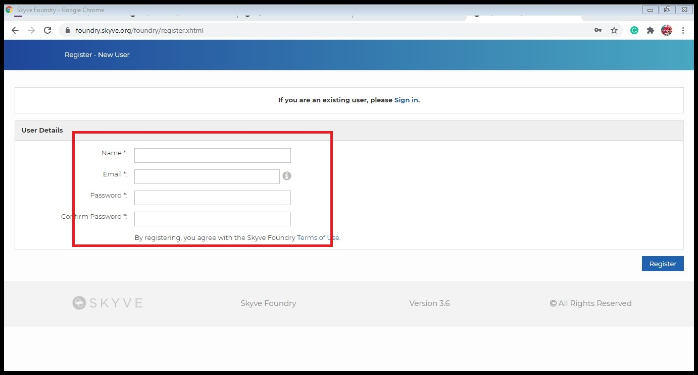
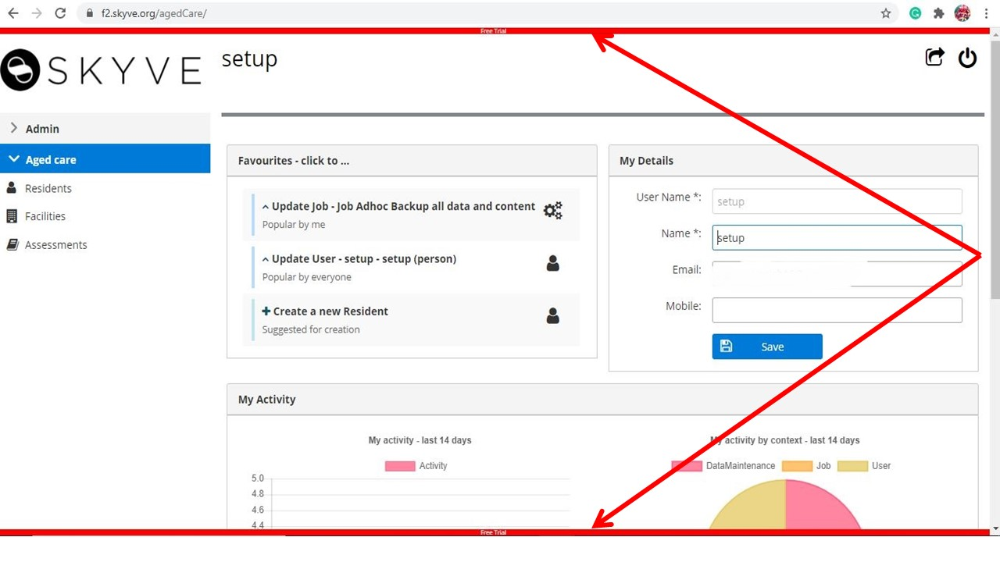

# Contents

- [2.1. Introduction to Foundry](#21-introduction-to-foundry)
- [2.2. Establish your AgedCare app in Foundry](#22-establish-your-agedcare-app-in-Foundry)
- [2.3. Data-driven Design in Foundry](#23-data-driven-design-in-foundry)
- [2.4. Create your Resident document](#24-create-your-resident-document)
- [2.5. Create your Facility document](#25-create-your-facility-document)
- [2.6. Create your Assessment document](#26-create-your-assessment-document)
- [2.7. Deploy your AgedCare app](#27-deploy-your-agedcare-app)
- [2.8. Using your AgedCare app](#28-using-your-agedcare-app)
- [2.9. Foundry & App FAQs](#29-foundry-&-app-)

# 2. No-code Development

In this section, we will go through the development of the Aged care application and will cover information about the Skyve platform and Skyve [Foundry](https://foundry.skyve.org/foundry/) in detail.

This section also covers how to create and add different documents: Resident, Assessments, and Facility in the Aged care application and how to deploy an application in [Foundry](https://foundry.skyve.org/foundry/).

### 2.1. Introduction to Foundry

Succinct statement of the purpose, key functions and general nature of Foundry, including (but not necessarily limited to):

- One-stop point-and-click tool for building apps
- Define all the data to be managed by your app, how it’s organised and how it’s related
- Deploy apps to a webserver so anyone can use them on the web

To create a new [Skyve](https://skyve.org) Project, we need to register our account first with following steps:

- Go to the [Skyve Foundry](https://Foundry.skyve.org/)
- Click on [Register](https://Foundry.skyve.org/Foundry/register.xhtml) and Enter your account details

  

- Active your Email address and if you are already register [Sign in](https://foundry.skyve.org/foundry Signin) with your register email and password.

To create a new skyve project through [Foundry](https://foundry.skyve.org/foundry/) go to the [How to get started](https://youtu.be/G3OQu5PeUn8) on the top right-hand side of skyve [Foundry](https://foundry.skyve.org/foundry/) page and watch the video for more information about how to create new application.

### 2.2. Establish your AgedCare app in Foundry

In the Skyve [Foundry](https://foundry.skyve.org/foundry/), we can create and manage the browser-based applications. Skyve [Foundry](https://foundry.skyve.org/foundry/) allows us to create numbers of application, and that each one will have a single record showing here on welcome screen.

Now, I will take you step by step creation of application:

- Click on the Add button

  

- Enter the name of App and email address

  

- Click on save, after that start build Data Design

### 2.3. Data-driven Design in Foundry

Data driven design refers to how organisations use data to make their content more appealing to users by analysing their behaviour. In Skyve Foundry, we used different data designs such as modules, documents, and attributes to design an application.

_*Modules:*_ In Skyve, modules define self-contained areas of functionality and have their own menu group. By default, Foundry apps start with a single module i.e Admin module. In the Design tab of your application, you can add or remove a module using the Add button.

_*Documents:*_ In data design, documents are related to the real business entities (e.g.resident, facility, assessment). For more details about documents click on this link https://skyvers.github.io/skyve-dev-guide/concepts/

_*Attributes:*_ Attributes contain information about each document (e.g. Resident's document attributes : name, id, photo, bio etc.). Attributes can have different data types and different view.

_*Data type:*_ Data type specifies which type of value an attribute name hold.

- Text or String: Used for a combination of any characters that appear on a keyboard, such as letters, numbers and symbols.

- Memo: Memo data type also called "Long Text". It is used to store large amount of text.

- Date: A Date includes the time, the year, the name of the day of the week, and the time zone.

- Image: Image data type is used where we want to upload an image in our document.

- Integer: It is used to store the numeric values.

- Association: This data type is used where there is a relationship between two entity object based on common attributes. An entity object only needs an association to access the data of another entity object.

### 2.4. Create your Resident document

The resident document will contain the personal information about the residents and the information about the facility they admitted.

Resident document contain attributes below:

| Attribute name | Data Type   | Length |
| -------------- | ----------- | ------ |
| ResidentID     | Text        | 100    |
| Resident Name  | Text        | 500    |
| Photo          | Image       |
| DOB            | Date        |
| Room Number    | Integer     |
| BIO            | Memo        |
| Admission Date | Date        |
| Facility name  | Association |

The `Facility name` attribute will be an association to a Facility (held in the Facility data table). The association represents a link to the entire Facility record (including name, address etc). In a database this would be called a foreign key. In Skyve it is called an association, and in the Aged Care application we are building - we will expect to see a drop-down list for this attribute so that the user can select the associated Facility record."

Now, we will create a Resident document and add attributes in Resident document in next few steps.

- Click on Data Design to add the Documents

  

- Add all information as shown below and click on Zoom out

  

- You can see your document on screen.

- Next, create documents for Facility and Assessments same as resident and click on arrow to add attributes for each document

  

- Click on Add button to add attributes to resident document

  

- Add all the attributes for Resident document as below

  

### 2.5. Create your Facility document

The Facility document will contain information about the facility(e.g.facility name, Facility manager), facility full address and location.

The attributes for Facility document as below:

| Attribute name   | Data Type   | Length |
| ---------------- | ----------- | ------ |
| Facility Name    | Text        | 500    |
| Building Number  | Integer     |
| Street Name      | Text        | 500    |
| Suburb           | Text        | 500    |
| State            | Text        | 100    |
| Facility manager | Association |

The `Facility manager` attribute will be an association to a system user (held in the User data table). The association represents a link to the entire User record (including name, access levels, contact details etc). In a database this would be called a foreign key. In Skyve it is called an association, and in the Aged Care application we are building - we will expect to see a drop-down list for this attribute so that the user can select the associated record for the system user who is the Facility manager."

This document will follow the same steps we followed for Resident document. It will look like as below:

### 2.6. Create your Assessment document

The Assessment document will contain information about all the care assessments related to each resident.

The attributes for Assessments document as below:

| Attribute name        | Data Type   | Length |
| --------------------- | ----------- | ------ |
| Hygiene Assessment    | Memo        |
| Pain Assessment       | Memo        |
| Continence Assessment | Memo        |
| Sleep Assessment      | Text        | 600    |
| Behaviour Assessment  | Memo        |
| Staff                 | Association |

The `Staff` attribute will be an association to a system user (held in the User data table). The association represents a link to the entire User record (including name, access levels, contact details etc). In a database this would be called a foreign key. In Skyve it is called an association, and in the Aged Care application we are building - we will expect to see a drop-down list for this attribute so that the user can select the associated record for the system user who is the Staff person.

Follow the same steps like Resident and Assessment documents. Assessment document look like as below.

### 2.7. Deploy your AgedCare app

Our Aged care application is almost ready, now the next step is to deploying our application to check how it look like. (Note: If you are using a free trail version, you can only deploy your application for an hours. To use the free version for another hour you need to redeploy it).

There are following steps to deploy Aged care application as we created in [Foundry](https://foundry.skyve.org/foundry/):

1. Go to [Foundry](https://foundry.skyve.org/foundry/) and click on Aged care application

   

2. Click on Deloy tab and then click on Deploy, usually it take 2 minutes to deploy your application

3. Next, click on the deploy link

   

4. Sign in with user "setup" and password which you initialised during deployment

### 2.8. Using your AgedCare app

Your application is ready to go. It contains two modules:Admin and Aged care. These two modules show as two menus in the application as shown below.
The Admin module is the provided as part of the Skyve platform for all applications. It provides a range of powerful administration features, including:

- user and access management
- scheduled backups and restoring from backups
- ability to import and export data
- scheduled jobs and tasks
- comprehensive system user activity audit tracking, keeping records of every user interaction in the system.

In the Aged care module, you we see the a menu item for each of the three documents we created in the foundry. Let's see how it look like...

Click to expand the Aged menu.

You will notice two red lines- one at the top of the screen and one at the bottom of the screen.
Generally organisations will run several instances of their application, for example, Production, Quality Assurance, Test/UAT and Development etc. For non-production instances, Skyve adds these labels so that the person using the system clearly understands whether they are working on a Production instance or not.

In this case, we are using the Foundry `Free Trial` instance, so the two red indicators show. When you move to a production instance (either hosted on Foundry, or on your own infrastructure) these instance identifiers will not show.

Click on Facility and then add button

Enter the detail of facility in the fields and click on "Ok" or "Save" button.

**Ok button:** This button performs Save and Close action on clicked. This will save the changes and return you in previous page.

**Save button:** This button will save any changes you perform in the current page when you click on it.

So, press Ok or Save as you go.

Next, click on Assessments

Add data in Assessments

#### Desktop Mode

Skyve provides two separate user interface: Normal mode and power user mode. In normal mode, the interface is responsive and mobile and tablet friendly where as the power user mode is great for desktop browsers.

To switch between interface click on the switch icon on the top-right of the application screen.

After switching

#### Making Changes and Re-Deploying

The [Foundry](https://foundry.skyve.org/foundry) free trial server will automatically undeploy your project after one hour - but you can redeploy your application as many times as you need during your testing and your data is saved while the project is offline.

### 2.9. Foundry & App FAQs

- Can I make changes to my app after I’ve deployed it?
- I deployed my app – why did it stop working ?
- How do I re-deploy my app ?
- I’ve got what I came for. Can I build my own app now ?

**[⬆ back to top](#contents)**
